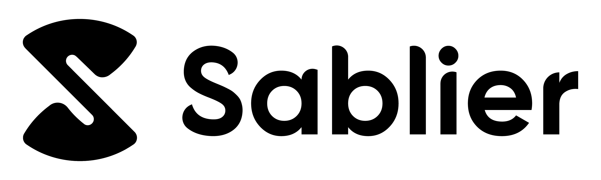

The official brand assets for any integrations, promotional or marketing materials.

## Guidelines

Don't combine the Sablier name or logos, or any portion of any of them, with any other logo, company name, mark, or generic terms, outside of pre-approved partnerships and collaborations. Please don't edit, modify, distort, rotate, or recolor the logo.

## Variations

| Type                                    | Location                              |
| --------------------------------------- | ------------------------------------- |
| Full logo, wide - PNG                   | [/logo/wide/png](/logo/wide/png/)     |
| Full logo, wide - SVG                   | [/logo/wide/svg](/logo/wide/svg/)     |
| Full logo, square - PNG                 | [/logo/square/png](/logo/square/png/) |
| Full logo, square - SVG                 | [/logo/square/svg](/logo/square/svg/) |
| Icon - PNG                              | [/icon/png](/icon/png)                |
| Icon - SVG                              | [/icon/svg](/icon/svg)                |
| Print (PDFs, PSDs)                      | [/print](/print)                      |
| Template (Banners, Covers)              | [/template](/template)                |
| NFT (Examples)                          | [/nft](/nft)                          |
| Other (Stream Circle, Contextual Icons) | [/other](/other)                      |

### Examples

| Color           | Icon and name                                                                  |
| --------------- | ------------------------------------------------------------------------------ |
| Black           |       |
| Dark            |        |
| Gradient, Dark  |   |
| Gradient        |    |
| White           |       |
| Gradient, White |  |

---

## Colors

Sablier's main color is a vibrant orange color on a dark blue color scheme. Since V2, Sablier follows a primarily dark theme (light theme coming soon). Please use the following colors accordingly.

| Color                 | HEX                                                                                               | Notes                                                      |
| --------------------- | ------------------------------------------------------------------------------------------------- | ---------------------------------------------------------- |
| Primary Start         | `#ff7300`  | Start point for the primary orange gradient                |
| Primary End           | `#ffb800`  | End point for the primary orange gradient                  |
| Primary Middle        | `#ff9C00`  | Median value derived from the primary orange gradient      |
| Secondary Start       | `#003dff`  | Start point the primary orange gradient                    |
| Secondary End         | `#00b7ff`  | End point for the primary orange gradient                  |
| Secondary Middle      | `#0063ff`  | Median value derived from the primary orange gradient      |
| Secondary Desaturated | `#266cd9`  | Desaturated value derived from the `Secondary Desaturated` |
| Dark 000              | `#14161f`  | Background (landing)                                       |
| Dark 050              | `#1a1d28`  |                                                            |
| Dark 100              | `#1e212f`  | Background (app)                                           |
| Dark 150              | `#212433`  |                                                            |
| Dark 200              | `#242838`  |                                                            |
| Dark 250              | `#262a3b`  |                                                            |
| Dark 300              | `#2a2e41`  | Borders (cards, boxes)                                     |
| Dark 400              | `#30354a`  | Borders (inputs)                                           |
| Dark 500              | `#363b54`  |                                                            |
| Dark 600              | `#3c425d`  |                                                            |
| Dark 700              | `#424966`  |                                                            |
| Dark 800              | `#484f70`  |                                                            |
| Dark 900              | `#4e5679`  |                                                            |
| Dark 1000             | `#545c82`  |                                                            |
| Gray 100              | `#e1e4ea`  | Text                                                       |
| Gray 200              | `#c3c9d5`  | Text                                                       |
| Gray 300              | `#a5aec0`  |                                                            |
| Gray 400              | `#8792ab`  | Labels                                                     |
| Gray 500              | `#6a7795`  |                                                            |
| Red                   | `#e52e52`  |                                                            |

# Notes

- The shades of black are obtained by increasing the lightness of the base `Dark 000`
- Noise is applied on top of illustrations or covers to reduce banding in gradients, so sampled colors may differ
- Black (`#000000`) is never used
- For the dark theme, long text should never be in full white (use `Gray 100 ... 400`)

## NFT

Every Sablier V2 stream is represented by a Hourglass NFT. Check out the [/nft](/nft/) directory for some examples of our dynamically generated designs.

| Streaming                  | Settled                     | Generic Art                            |
| -------------------------- | --------------------------- | -------------------------------------- |
|  |  |  |

## Video

Sablier V2 has an official promotional video that collaborators can use to present the product in articles or other visual content pieces.

## Support

Questions? Join [our Discord server](https://discord.gg/KXajCXC) and ask them there.
